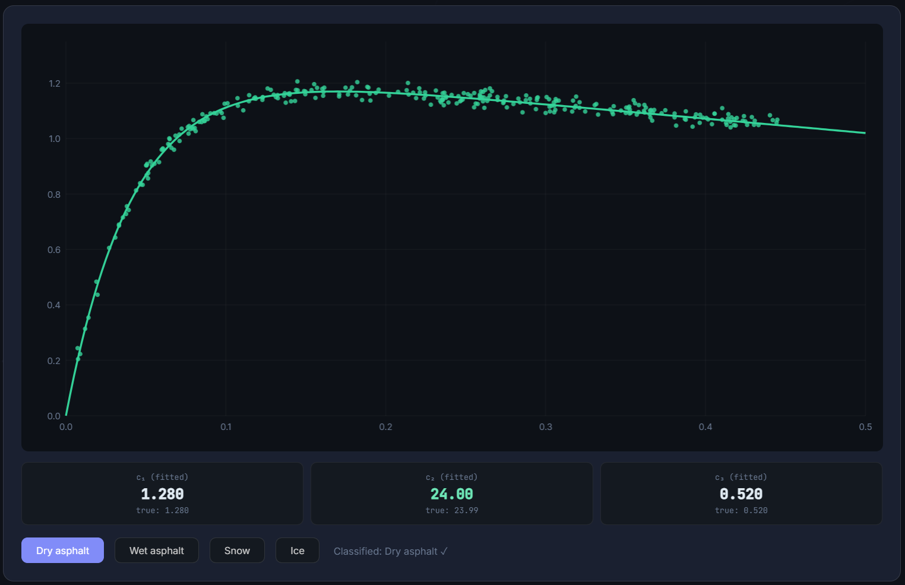

# Real-Time Tire-Road Friction Identification

[](https://sajjad-shahali.github.io/NTT_DATA_hackathon/friction-demo.html)
[](LICENSE)
[](https://www.python.org/)
[](https://numpy.org/)
[](https://scipy.org/)
[](https://scikit-learn.org/)
[](https://matplotlib.org/)
[](https://pandas.pydata.org/)
[](https://www.mathworks.com/products/matlab.html)

**NTT DATA BEST Hackathon 2026 · Politecnico di Torino · Team 24**

A real-time tire-road friction identification system using an Extremum Seeking Control (ESC) gradient-based algorithm. The system continuously estimates Burckhardt friction model parameters from live wheel slip and friction measurements, enabling optimal slip tracking for maximum braking and traction force.

---

## Visualizations

### Burckhardt Friction Curves
Parametric μ(s) curves for all four road surfaces (dry asphalt, wet asphalt, snow, ice) with peak friction and optimal slip markers.


### Surface Classification Plot
Classification results mapped against the Burckhardt friction curve — shows how the ESC identifier assigns each measurement batch to the correct surface type.



---

## Overview

The core algorithm is a three-layer identifier (`ESCTwoPointID`) ported from MATLAB to Python. It is validated against 48 closed-loop braking simulations and exposed through an interactive web demo.

### The Burckhardt Friction Model

```
μ(s) = c₁ · (1 − exp(−c₂ · |s|)) − c₃ · |s|

s_opt  = ln(c₁·c₂ / c₃) / c₂     # slip at peak friction
μ_peak = μ(s_opt)
```

| Surface | c₁ | c₂ | c₃ | μ_peak | s_opt |
|---|---|---|---|---|---|
| Dry asphalt | 1.2801 | 23.99 | 0.52 | ~1.17 | ~0.17 |
| Wet asphalt | 0.857 | 33.82 | 0.347 | ~0.80 | ~0.13 |
| Snow | 0.1946 | 94.13 | 0.0646 | ~0.19 | ~0.06 |
| Ice | 0.05 | 306.4 | 0.001 | ~0.05 | ~0.03 |

**Key discriminant:** c₂ separates surfaces cleanly — 24 vs 34 vs 94 vs 306.

---

## Algorithm — Three-Layer ESC Identifier

```
┌──────────────────────────────────────────────────────┐
│  LAYER 1 — LUT (always active)                       │
│  μ_max → interpolate → c₂_coarse                    │
├──────────────────────────────────────────────────────┤
│  LAYER 2 — ESC-Gradient Analytic                     │
│  g_esc + (s, μ) → solve analytically → c₁, c₃       │
│  Works at ANY operating point — no peak assumption   │
├──────────────────────────────────────────────────────┤
│  LAYER 3 — Brent Root-Finding                        │
│  Two-point → refined c₂ (when slip excitation > δ)  │
└──────────────────────────────────────────────────────┘
```

**Sign convention:** `g_true = −g_esc · 2 / a_esc`

---

## Repository Structure

```
NTT_DATA_hackathon/
├── hackaton_id.py           # ESCTwoPointID — Python port of MATLAB identifier
├── predict_mu.py            # Offline μ(s) prediction — NLS vs GP vs NN comparison
├── preprocess.py            # Raw CSV → prepared_friction.csv pipeline
├── make_plots.py            # Regenerate all presentation plots (01–05)
├── load_mat_data.py         # Inspect / filter / prepare friction_data_full.csv
├── plot_data_exploration.py # EDA plots 06–10 (real simulation data)
├── plot_burckhardt_vs_real.py # c_matrix curves vs real scatter (plots 11–12)
├── evaluate_unlabeled.py    # Surface ID from unlabeled (slip,μ) — plot 13
├── eval_classification.py   # F1 / Precision / Recall evaluation — plot 14
├── eval_robustness.py       # Monte Carlo robustness comparison across classifier variants
├── src/
│   ├── burckhardt.py        # Burckhardt model math, surface presets, s_opt/μ_peak utils
│   └── data_gen.py          # Synthetic (slip, μ) dataset generation
│             =
├── data/
│   ├── raw/                 # friction_data_full.csv (export from MATLAB)
│   └── synthetic/           # Auto-generated Burckhardt curves
├── models/                  # Saved fitted models
├── docs/
│   └── friction-demo.html   # Static interactive demo page
├── reports/                 # Team photos and generated plots
├── deliverables/
│   ├── plot.png             # Surface classification plot vs Burckhardt curves
│   └── Burckhardt Friction Curves.png  # Burckhardt μ(s) curves for all surfaces
├── requirements.txt
└── README.md
```

---

## Installation

```bash
git clone https://github.com/Sajjad-Shahali/NTT_DATA_hackathon.git
cd NTT_DATA_hackathon

# Activate virtual environment (Windows/Git Bash)
source .env/Scripts/activate

# Install dependencies
pip install -r requirements.txt
```

---

## Web Demo

An interactive landing page visualises the algorithm and exposes an in-browser classifier.

### Run

```bash
# Windows (without activating venv)
.env/Scripts/python.exe app.py

# Or with venv activated
python app.py
```

Open `http://localhost:5000` in the browser.

### Features

| Section | Description |
|---|---|
| Animated NLS Fitting | Watch Burckhardt curve converge live as noisy data accumulates — choose Dry / Wet / Snow / Ice |
| Burckhardt Friction Curves | All 4 surfaces plotted with peak markers + confusion matrix + F1 bars |
| Robustness Comparison | Monte Carlo F1 vs σ_μ and σ_s curves for 4 classifier variants |
| Noise Slider | Interactive σ_μ sweep 0→0.10 with live F1 / Balanced Accuracy |
| Upload Your Data | Drop a CSV with `slip` + `mu_noisy` columns — classified entirely in-browser |
| Algorithm | Three-layer ESC identifier diagram + Burckhardt equation |
| Literature | 8 key references (Burckhardt 1993, Gustafsson 1997, Pacejka 2012, …) |
| Team | Authors + affiliations |

### API

```
POST /api/classify
Body: { "slips": [...], "mus": [...] }
Returns: { "surface": "Dry asphalt", "c1": 1.280, "c2": 23.99, "c3": 0.520, "mu_peak": 1.172 }
```

---

## Classifier Variants — Robustness to Noise

Three improvements over the baseline were implemented and compared via Monte Carlo (100 batches × 8 σ levels):

| Variant | Batch | Classify on | Improvement at σ_μ=0.05 |
|---|---|---|---|
| Baseline | 50 | 3D NN (c₁,c₂,c₃) | — |
| Large batch ×2 | 100 | 3D NN | +~0.25 F1 |
| c₂-only | 50 | c₂ alone | +~0.15 F1 |
| Majority vote ×3 | 50 | 3D NN, last-3 vote | +~0.10 F1 |

Run the comparison via **▶ Run Comparison** button in the web demo.

---

## Python API — `ESCTwoPointID`

```python
import numpy as np
from hackaton_id import ESCTwoPointID

identifier = ESCTwoPointID()

params = np.array([
    8,      # [0]  buf_size
    0,      # [1]  (unused)
    0.008,  # [2]  fark_threshold
    0,      # [3]  (unused)
    0.5,    # [4]  t_start
    0.5,    # [5]  c1_min
    2.0,    # [6]  c1_max
    10.0,   # [7]  c2_min
    150.0,  # [8]  c2_max
    0.01,   # [9]  c3_min
    1.0,    # [10] c3_max
    0.8,    # [11] mu_buf_init
    0.05,   # [12] s_buf_init
    1e-4,   # [13] brent_tol
    20,     # [14] brent_iter
])

result = identifier.identify(
    mu_measured=0.85, s_measured=0.12, s_probe=0.10,
    c1_prev=1.28, c2_prev=23.99, c3_prev=0.52,
    t=1.0, params=params, g_esc=-0.03, a_esc=0.02,
)

(c1, c2, c3, s_opt, mu_opt, valid, debug_flag,
 best_fark, fark_now, best_s, best_mu,
 s_at_peak, mu_opt_est) = result

if valid:
    print(f"c1={c1:.3f}  c2={c2:.2f}  c3={c3:.4f}  s_opt={s_opt:.4f}")
```

**`debug_flag` values:** 0=Brent+grad, 1=warmup, 10=LUT+grad, 20=LUT+peak_fallback

---

## Data Pipeline

```bash
# 1. Export from MATLAB
run('run_validation_updated.m')   # 48 simulations → results
run('export_for_python.m')        # → friction_data_full.csv (29 columns)

# 2. Copy to project
cp friction_data_full.csv data/raw/

# 3. Preprocess
python preprocess.py              # → data/raw/prepared_friction.csv (20,616 rows)

# 4. Evaluate classifier
python eval_classification.py     # F1 / Precision / Recall — plot 14
python evaluate_unlabeled.py      # Unlabeled surface ID — plot 13

# 5. Train prediction models
python predict_mu.py --data data/raw/prepared_friction.csv --n-train 500

# 6. Generate all plots
python make_plots.py
```

### Preprocessing summary

| Step | Filter | Rows remaining |
|---|---|---|
| Raw | — | ~765,000 |
| ABS filter | abs_active == 1 | ~479,000 |
| Confidence filter | α > 0.01 | ~340,000 |
| Stride=10 | Thin autocorrelated series | ~48,000 |
| Balance | Snow≤12k / Dry,Wet≤6k each | **20,616** |

---

## Classification Results

**Method:** Burckhardt NLS fit → normalised nearest-neighbour in (c₁,c₂,c₃) space.
**Eval:** 20% stratified hold-out of prepared_friction.csv — 82 batches of 50 pts.

| Surface | Precision | Recall | F1 | Batches |
|---|---|---|---|---|
| Dry asphalt | 1.0000 | 1.0000 | 1.0000 | 17 |
| Wet asphalt | 1.0000 | 1.0000 | 1.0000 | 17 |
| Snow | 1.0000 | 1.0000 | 1.0000 | 48 |
| **Macro avg** | **1.0000** | **1.0000** | **1.0000** | 82 |

**Why perfect:** c₂ separates surfaces widely (24 vs 34 vs 94). Noise erodes performance only above σ_μ ≈ 0.05.

---

## Presentation Plots

Regenerate with `python make_plots.py` → `reports/plots/`:

| File | Content |
|---|---|
| `01_surfaces_overview.png` | All 4 Burckhardt curves with μ_peak & s_opt |
| `02_model_comparison.png` | NLS vs GP vs NN per surface |
| `03_rmse_comparison.png` | RMSE grouped by method and surface |
| `04_data_efficiency.png` | RMSE vs training-set size |
| `05_identifier_convergence.png` | ESC identifier converging across surfaces |
| `06–10` | EDA plots — slip dist, μ vs slip, alpha, scenario coverage |
| `11–12` | Burckhardt curves vs real scatter |
| `13` | Unlabeled surface ID evaluation |
| `14` | F1 / Precision / Recall per surface |

---

## Known Issues

| Issue | Location | Details |
|---|---|---|
| Brent swap bug | `hackaton_id.py` ~line 265 | `a_b=b_b; b_b=c_br; c_br=a_b` — duplicates old `b_b`. Identical bug in MATLAB source; fix only when MATLAB is corrected |

---

## Team

| Name | Role | Programme |
|---|---|---|
| **Sajjad Shahali** | Machine Learning Engineer | MSc — [Politecnico di Torino](https://www.polito.it/) |
| **Omer Ozkan** | Data Science & Engineer | MSc — [Politecnico di Torino](https://www.polito.it/) |
| **Kaan Sadik Aslan** | Mechatronic Engineering | MSc — [Politecnico di Torino](https://www.polito.it/) |
| **Berk Ali Demir** | Electrical Computer Engineering | MSc — [Politecnico di Torino](https://www.polito.it/) |

---

## License

Developed for the NTT DATA BEST Hackathon 2026 at Politecnico di Torino.
